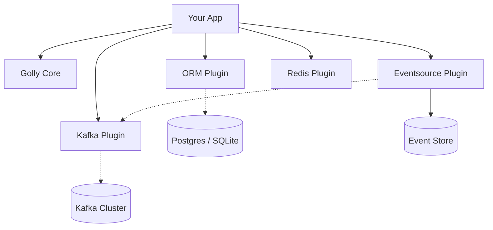

# Golly Plugins

The official, curated extension ecosystem for the [Golly](https://github.com/golly-go/golly) framework.

> **Opt-in Power. Zero Bloat.**

Golly's core philosophy is to keep the runtime lightweight. We don't force a database, a message broker, or a specific API style on you. Instead, we provide these capabilities as **Plugins**—independent, production-hardened modules that you can snap into your application when you need them.

## 🗺 The Ecosystem



## 🚀 Feature Highlights

### 💾 ORM: Battle-Tested Persistence

Don't waste time wiring up databases. The **ORM Plugin** gives you a pre-configured [GORM](https://gorm.io) instance, fully integrated with Golly's context and logger.

- **Drivers**: PostgreSQL, SQLite.
- **Features**: Auto-migrations, connection pooling, context propagation.
- **Import**: `github.com/golly-go/plugins/orm`

### ⏳ Eventsource: Time-Travel for Data

Build complex, event-driven systems without the headache. The **Eventsource Plugin** provides a robust engine for managing aggregates and event streams.

- **Pattern**: CQRS + Event Sourcing made simple.
- **Storage**: Pluggable backends (ORM, etc).
- **Import**: `github.com/golly-go/plugins/eventsource`

### 📨 Kafka: The Streaming Backbone

High-throughput messaging powered by [Franz-go](https://github.com/twmb/franz-go), the fastest Kafka client for Go.

- **Performance**: Zero-copy consumer paths.
- **Integration**: Automatic graceful shutdown and health checks.
- **Import**: `github.com/golly-go/plugins/kafka`

### ⚡ Redis: High-Speed Caching

Instant access to your hot data.

- **Client**: Built on `go-redis`.
- **Import**: `github.com/golly-go/plugins/redis`

### 🕸️ GraphQL: Modern API Layer

Expose your data with a flexible, strongly-typed query language.

- **Import**: `github.com/golly-go/plugins/gql`

---

## 🛠 Real-World Production Example

Mix and match plugins to build exactly what you need. Here is a full-stack equivalent application:

```go
package main

import (
	"github.com/golly-go/golly"
	"github.com/golly-go/plugins/eventsource"
	"github.com/golly-go/plugins/kafka"
	"github.com/golly-go/plugins/orm"
)

func main() {
	golly.Run(golly.Options{
		Name:    "payment-processor",
		Version: "1.0.0",

		// 1. Register Plugins
		Plugins: []golly.Plugin{
			// Database
			orm.NewPlugin(orm.Config{Driver: "postgres"}),

			// Event Bus
			kafka.NewPlugin(kafka.Config{Brokers: []string{"localhost:9092"}}),

			// Event Sourcing Engine (using ORM and Kafka)
			eventsource.NewPlugin(
				eventsource.WithStore(&orm.EventStore{}),
				eventsource.WithDispatcher(&kafka.Dispatcher{}),
			),
		},

		// 2. Initialize Logic
		Initializer: func(app *golly.Application) error {
			// Your domain logic here
			return nil
		},
	})
}
```

## 📦 Installation

Plugins are separate modules to keep your dependency tree clean.

```bash
# Add the database layer
go get github.com/golly-go/plugins/orm

# Add event streaming
go get github.com/golly-go/plugins/kafka
```

## Contributing

We welcome contributions! Please see the [Contributing Guide](CONTRIBUTING.md) for details on how to propose new plugins or improvements.

## License

MIT
